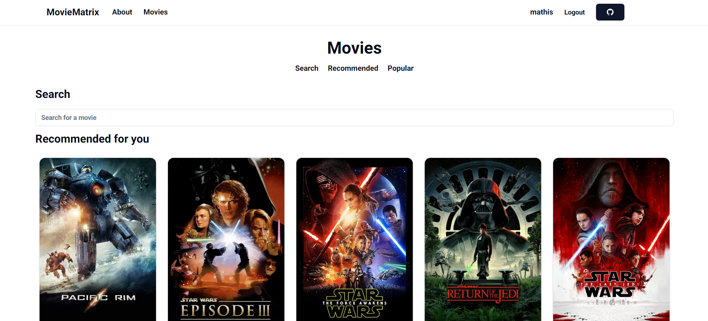

# MovieMatrix

A movie recommendation web application built with Rust and Next.js that helps you choose the next movie you're going to watch.

[![Contributors][contributors-shield]][contributors-url]
[![Stargazers][stars-shield]][stars-url]
[![Issues][issues-shield]][issues-url]

## About the project

This application was produced as part of a project by 3 students in the space of 4 days.

### Screenshots

Here are a few screenshots of our user interface.

#### Landing page

The landing page features everything new users need before they sign up: presentation, data, FAQ, ...


#### Movie browser

Here, you can take advantage of the infinite scroll function to select a film from a selection based on our recommendation algorithm, or search for a particular film.



#### Film info

By clicking on a movie's card, you can view information about it, such as its rating, cast and synopsis, but also recommendations of similar movies.


### Built with

[![Next][Next.js]][Next-url]
[![Rust][Rust]][Rust-url]

Using the gRPC protocol, we've combined the power and speed of Rust with the ease and capabilities of Next.js, resulting in an application that's quick and easy to use, but also easy to maintain.

## Quick Start

### Environment variables

The `.env` is currently not loaded by the Next.js server nor by the rust api, so its is needed to export the environment variables manually:

```bash
export APP_THE_MOVIE_DB__API_KEY=your_tmdb_api_key
```

### Requirements

-   [Node.js](https://nodejs.org/en/) (v22.2.0)
-   [pnpm](https://pnpm.io/) (v9.1.4)
-   [Docker](https://www.docker.com/)
-   [protobuf](https://protobuf.dev/) (v27.0)
-   [sqlx-cli](https://docs.rs/crate/sqlx-cli/0.5.7) (v0.5.7)
-   [Libtorch](https://pytorch.org/cppdocs/installing.html) (v2.1.0)

### Install dependencies

-   Install node modules:

    ```bash
    pnpm install
    ```

-   Install `cargo-watch` (for hot-reloading):

    ```bash
    cargo install cargo-watch
    ```

### Start the development server

First initialize the database. It will start a docker container based on postgres' Docker image on `http://localhost:5432`.

```bash
bash ./scripts/init_db.sh`
```

This will start the development server at `http://localhost:3000` and the API server at `http://localhost:4000`.

```bash
pnpm dev
```

### Build for production

First build and start the Rust api:

```bash
cd ./api && cargo build -r && ./target/release/api
```

Then build the Next.js server and run it:

```bash
cd ./web && pnpm build && pnpm start
```

[contributors-shield]: https://img.shields.io/github/contributors/mathisbot/movie-matrix.svg?style=for-the-badge
[contributors-url]: https://github.com/mathisbot/movie-matrix/graphs/contributors
[stars-shield]: https://img.shields.io/github/stars/mathisbot/movie-matrix.svg?style=for-the-badge
[stars-url]: https://github.com/mathisbot/movie-matrix/stargazers
[issues-shield]: https://img.shields.io/github/issues/mathisbot/movie-matrix.svg?style=for-the-badge
[issues-url]: https://github.com/mathisbot/movie-matrix/issues
[Next.js]: https://img.shields.io/badge/next.js-000000?style=for-the-badge&logo=nextdotjs&logoColor=white
[Rust]: https://img.shields.io/badge/Rust-%23000000.svg?style=for-the-badge&logo=rust&logoColor=white
[Next-url]: https://nextjs.org/
[Rust-url]: https://rust-lang.org/
